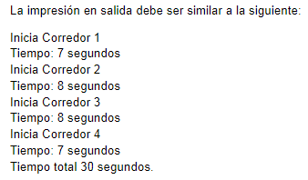

## Consigna: Simulación de Carrera de Postas

**Objetivo:**
Implementar una simulación de un entrenamiento de carrera de postas para un equipo de cuatro integrantes.

**Condiciones:**

- **Orden de salida:** El primer integrante inicia la carrera, seguido por los otros tres en posiciones más adelantadas.
- **Entrega de la posta:** Cada corredor debe correr hasta la posición del siguiente y entregarle la posta.
- **Tiempo de tramo:** El tiempo que tarda cada corredor en completar su tramo es aleatorio, entre 5 y 10 segundos.
- **Sincronización:** Un corredor solo puede comenzar su tramo cuando el anterior le haya entregado la posta.

**Requisitos:**

- **Hilos (Threads):** Cada corredor debe ser representado por un hilo de ejecución independiente.
- **Finalización:** Cada hilo debe finalizar dentro del rango de tiempo aleatorio establecido.
- **Este es un ejemplo de output**

